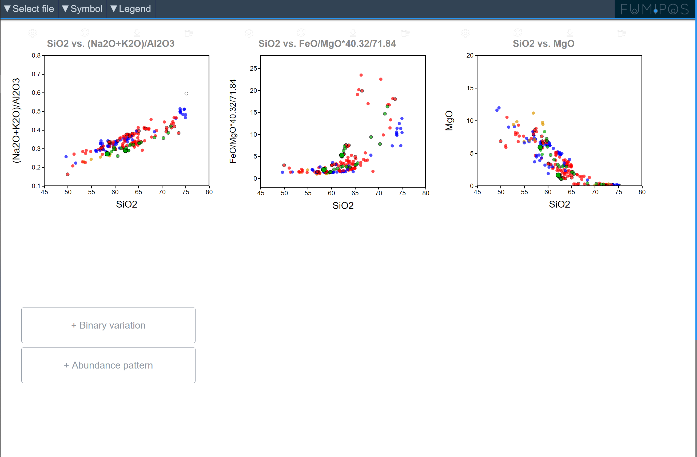
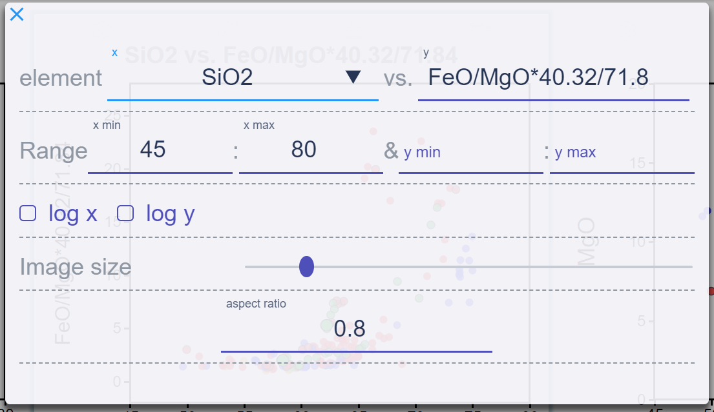
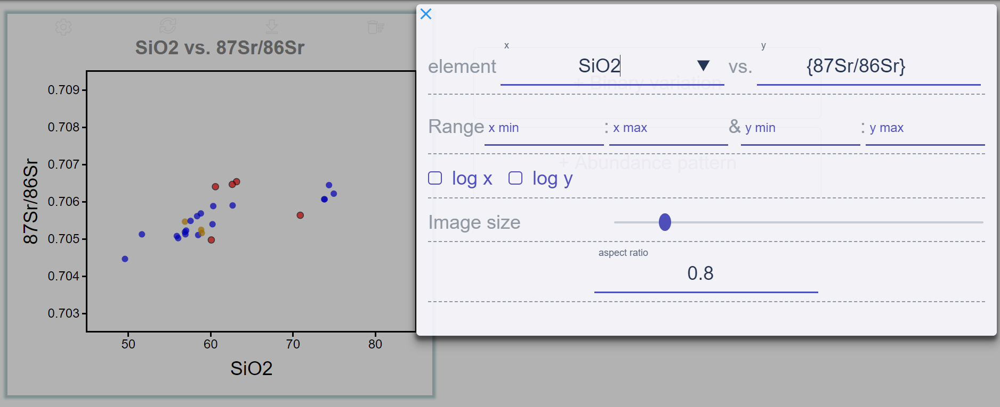

# FUMIPOS

Auther: Fumipo-Theta
Current version: 3.0

[FUMIPOS app page](https://fumipo-theta.github.io/fumipos/)

## Abstruct

Webブラウザ上で動作するインタラクティブな散布図作成アプリケーション.
散布図間で対応するデータを強調表示し, 多次元データの理解を助ける.

x軸とy軸の指定にはそれぞれ数式を用いることができる. 数式の中に表データの列名を用いると, 表データの各行に数式が適用されプロットされる.

数式では, 四則演算 `+`, `-`, `*`, `/`と, 計算順序を表す括弧`(`, `)`, 実数, そして表の列名を表す変数を用いることができる.
ここで, 変数とみなされるのは数字と小数点`.`以外の文字を含む文字列である.
ただし, 記号`+-*/()`は優先的に四則演算のための記号とみなされるので, これらの文字を含む列名を変数として用いるためには, 変数の文字列を波括弧`{`,`}`で囲む必要がある.

次の例では, x軸には表の`SiO2`列の値が用いられる. そしてy軸には表の各行の`FeO`列と`MgO`列の値から `FeO / MgO × 40.32 / 71.84` が計算されてプロットされる.

また, 次の例ではx軸に表の`SiO2`列の値が, y軸には表の`87Sr/86Sr` 列が用いられてプロットされる.

